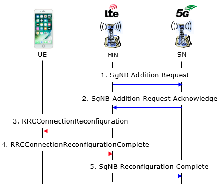
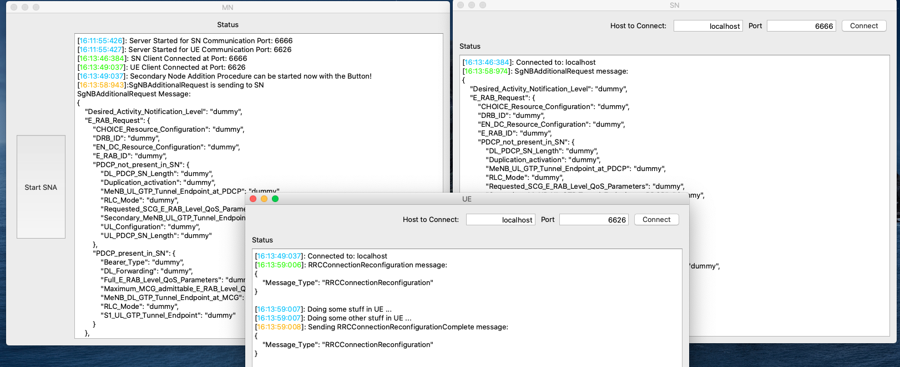

# SecondaryNodeAddition
### Definition
This repository is basic demonstration of Secondary Node Addition prosedure.

**Secondary Node Addition** is define how to add SN to existing MN(LTE Cell). There is 3 processes to communicate: **UE**, **MN**, **SN**. Procedure is starts from MN node with SgNBAdditionRequest. TCP sockets are used for communication. 

Procedure is illustrated below



Qt Framework is used Demonstration with graphical interfaces.
### Build
- Clone the repository or download.
``` 
    git clone https://github.com/alperyazir/SecondaryNodeAddition.git
```
- Can be build any platform(linux,windows,osx) with QtCreator. It has no dependencies except `network` modulu in Qt. Be sure that added the .pro file in the projects. For example:
`QT+= network` 

- Executables are in the same directory in SecondaryNodeAddition/builds... directory.

### Usage
- **MN** is main server. It starts two servers for SN and UE. 
SN port is defined `6666`
UE port is defined `6626`
Ports can be changable in MN>MainWindows.cpp constructor.

- **SN** and **UE** connect the MN as clients with connect button and hostname and port parameters.
- When connections are done, **Start SNA** button on MN's UI is going to be enable to start procedure.

- Messages can be observed on status window for all processes with the time stamps. So, messages order can be trackable corresponding the precedure.
- Colors on the status windows:
    * <span style="color:blue">Blue</span>: Status color  
    * <span style="color:green">Green</span>: Incoming message color
    * <span style="color:orange">Orange</span>: Outgoing message color
    * <span style="color:red">Red</span>: Error color


## Screenshots



